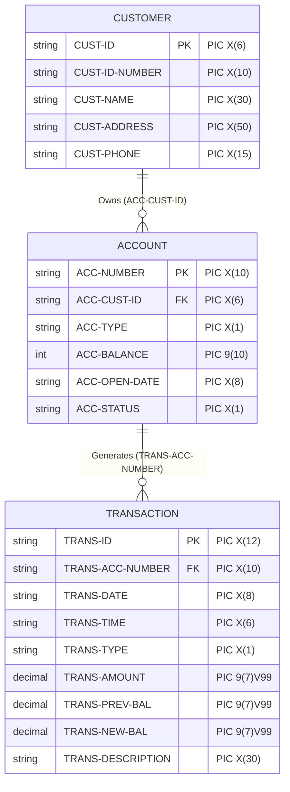

[English](data_structures.en.md) | [繁體中文](data_structures.md)

# Bank Management System - Data Structures Documentation

This document provides a detailed description of the data file formats and COBOL record structures (Record Layouts) used in the system. The system adopts the **Line Sequential** organization format, where each line represents a record, fields are arranged by fixed lengths, and newline characters (LF or CRLF) are used as record delimiters.

> [!WARNING]
> This project is designed solely as a code syntax demonstration and does not implement any data encryption or security mechanisms (sensitive information such as ID card numbers, phone numbers, balances, and transaction details are stored in plain text). Do not use this project directly in actual production or commercial environments.

---

## 1. Entity Relationship Diagram

The data in the system consists of three sequential tables, and their relationships are shown below:



---

## 2. Customer Data File (CUSTOMER.SAM)

Stores basic customer identification information. Each record has a fixed length of **111 Bytes**.

### COBOL Record Structure

```cobol
FD  CUSTOMER-FILE.
01  CUSTOMER-RECORD.
    05  CUST-ID             PIC X(6).       *> Customer Unique ID
    05  CUST-ID-NUMBER      PIC X(10).      *> ID Card Number
    05  CUST-NAME           PIC X(30).      *> Customer Name (padded with spaces)
    05  CUST-ADDRESS        PIC X(50).      *> Customer Address (padded with spaces)
    05  CUST-PHONE          PIC X(15).      *> Customer Phone (15 characters)
```

### Field Details

| Field Name | COBOL Type | Length (Bytes) | Description |
| :--- | :--- | :---: | :--- |
| `CUST-ID` | `PIC X(6)` | 6 | Customer unique identifier. Automatically generated by the system starting increment from `000001`, padded with spaces on the right if less than 6 digits. |
| `CUST-ID-NUMBER` | `PIC X(10)` | 10 | Taiwan ID card number (e.g., `A123456789`). Validated by the system using a weighted checksum algorithm. |
| `CUST-NAME` | `PIC X(30)` | 30 | Customer name, supports Chinese and English. Under UTF-8, each Chinese character takes 3 bytes. Padded with spaces on the right if shorter than the field length. |
| `CUST-ADDRESS` | `PIC X(50)` | 50 | Customer contact address, padded with spaces on the right if shorter than the field length. |
| `CUST-PHONE` | `PIC X(15)` | 15 | Customer phone number (e.g., `0912345678` or `02-23456789`). |

### File Data Example

```text
000001A123456789王小明                          台北市信義區信義路五段7號                         0912345678     
```
* `000001`: Customer ID (6 columns).
* `A123456789`: ID Card Number (10 columns).
* `王小明                          `: Name (30 columns, padded with spaces).
* `台北市信義區信義路五段7號                         `: Address (50 columns, padded with spaces).
* `0912345678     `: Phone Number (15 columns, padded with spaces).

---

## 3. Account Data File (ACCOUNT.SAM)

Stores balances and statuses of all bank accounts. Each record has a fixed length of **36 Bytes**.

### COBOL Record Structure

```cobol
FD  ACCOUNT-FILE.
01  ACCOUNT-RECORD.
    05  ACC-NUMBER          PIC X(10).      *> Bank Account Number (10 digits)
    05  ACC-CUST-ID         PIC X(6).       *> Associated Customer ID
    05  ACC-TYPE            PIC X(1).       *> Account Type (S: Savings, C: Checking)
        88  SAVINGS         VALUE "S".
        88  CHECKING        VALUE "C".
    05  ACC-BALANCE         PIC 9(10).      *> Account Balance (integer without decimal)
    05  ACC-OPEN-DATE       PIC X(8).       *> Account Opening Date (YYYYMMDD)
    05  ACC-STATUS          PIC X(1).       *> Account Status (A: Active, C: Closed, S: Suspended)
        88  ACTIVE          VALUE "A".
        88  CLOSED          VALUE "C".
        88  SUSPENDED       VALUE "S".
```

### Field Details

| Field Name | COBOL Type | Length (Bytes) | Description |
| :--- | :--- | :---: | :--- |
| `ACC-NUMBER` | `PIC X(10)` | 10 | Bank account number, automatically generated by the system starting increment from `0000000001`. |
| `ACC-CUST-ID` | `PIC X(6)` | 6 | ID of the customer to whom the account belongs, corresponding to `CUST-ID` in `CUSTOMER.SAM`. |
| `ACC-TYPE` | `PIC X(1)` | 1 | Account type:<br>`S`: Savings Account<br>`C`: Checking Account |
| `ACC-BALANCE` | `PIC 9(10)` | 10 | Account balance, padded with leading zeros (e.g., integer `0000500000` representing 500,000, max up to 9,999,999,999). |
| `ACC-OPEN-DATE` | `PIC X(8)` | 8 | Account opening date, formatted as `YYYYMMDD` (e.g., `20260712`). |
| `ACC-STATUS` | `PIC X(1)` | 1 | Account status:<br>`A`: Active<br>`C`: Closed<br>`S`: Suspended |

### File Data Example

```text
0000000001000001S000050000020260712A
```
* `0000000001`: Account number is 1.
* `000001`: Customer ID is 1.
* `S`: Account type is Savings.
* `0000500000`: Account balance is 500,000 (padded with leading zeros).
* `20260712`: Account opening date is July 12, 2026.
* `A`: Account status is Active.

---

## 4. Transaction File (TRANS.SAM)

Stores all transaction histories for deposits, withdrawals, and transfers. Each record has a fixed length of **94 Bytes**.

### COBOL Record Structure

```cobol
FD  TRANS-FILE.
01  TRANS-RECORD.
    05  TRANS-ID            PIC X(12).      *> Transaction Unique ID
    05  TRANS-ACC-NUMBER    PIC X(10).      *> Transaction Account Number
    05  TRANS-DATE          PIC X(8).       *> Transaction Date (YYYYMMDD)
    05  TRANS-TIME          PIC X(6).       *> Transaction Time (HHMMSS)
    05  TRANS-TYPE          PIC X(1).       *> Transaction Type (D: Deposit, W: Withdrawal, T: Transfer)
        88  DEPOSIT         VALUE "D".
        88  WITHDRAWAL      VALUE "W".
        88  TRANSFER        VALUE "T".
    05  TRANS-AMOUNT        PIC 9(7)V99.    *> Transaction Amount (implied 2 decimal places)
    05  TRANS-PREV-BAL      PIC 9(7)V99.    *> Balance before transaction (implied 2 decimal places)
    05  TRANS-NEW-BAL       PIC 9(7)V99.    *> Balance after transaction (implied 2 decimal places)
    05  TRANS-DESCRIPTION   PIC X(30).      *> Transaction Description (padded with spaces)
```

### Field Details

| Field Name | COBOL Type | Length (Bytes) | Description |
| :--- | :--- | :---: | :--- |
| `TRANS-ID` | `PIC X(12)` | 12 | Transaction unique identifier, automatically generated and incremented by the system (padded with leading zeros). |
| `TRANS-ACC-NUMBER` | `PIC X(10)` | 10 | The bank account number associated with the transaction. |
| `TRANS-DATE` | `PIC X(8)` | 8 | Transaction date, formatted as `YYYYMMDD`. |
| `TRANS-TIME` | `PIC X(6)` | 6 | Transaction time, formatted as `HHMMSS`. |
| `TRANS-TYPE` | `PIC X(1)` | 1 | Transaction type:<br>`D`: Deposit<br>`W`: Withdrawal<br>`T`: Transfer |
| `TRANS-AMOUNT` | `PIC 9(7)V99` | 9 | Transaction amount. `V` represents an implied decimal point, which **does not occupy bytes** in the physical file. For example: stored as `001000000` in the file to represent `10,000.00`. |
| `TRANS-PREV-BAL` | `PIC 9(7)V99` | 9 | Account balance before the transaction (with 2 implied decimal places). |
| `TRANS-NEW-BAL` | `PIC 9(7)V99` | 9 | Account balance after the transaction (with 2 implied decimal places). |
| `TRANS-DESCRIPTION` | `PIC X(30)` | 30 | Transaction description (e.g., "Initial Deposit", "Counter Deposit", "Transfer to Account: 0000000002", etc.), padded with spaces on the right to 30 characters. |

### Implied Decimal Point Example & Analysis

When the amount is defined as `PIC 9(7)V99`:
* Actual length: 7 integer digits + 2 decimal digits = 9 bytes.
* Example value `000200050`:
  - The first 7 digits `0002000` represent the integer `2000`.
  - The last 2 digits `50` represent the decimal `.50`.
  - The actual value is `2,000.50` dollars.

### File Data Example

```text
000000000009000000000120260712121544T000200000001500000001300000轉出至帳號: 0000000002     
```
* `000000000009`: Transaction ID (12 columns).
* `0000000001`: Transaction account number (10 columns).
* `20260712`: Transaction date (8 columns).
* `121544`: Transaction time 12:15:44 (6 columns).
* `T`: Transfer transaction (1 column).
* `000200000`: Transaction amount `2,000.00` (9 columns).
* `001500000`: Balance before transaction `15,000.00` (9 columns).
* `001300000`: Balance after transaction `13,000.00` (9 columns).
* `轉出至帳號: 0000000002     `: Transfer description (30 columns).

---

## 5. Temporary Account File (TEMP-ACCOUNT.SAM)

The structure is identical to `ACCOUNT.SAM` (fixed length of 36 bytes), primarily used for temporarily storing updated account data. For detailed mechanisms, please refer to the "Safe File Update Mechanism" in the [System Operation & Compilation Guide](./operation_manual.en.md).
