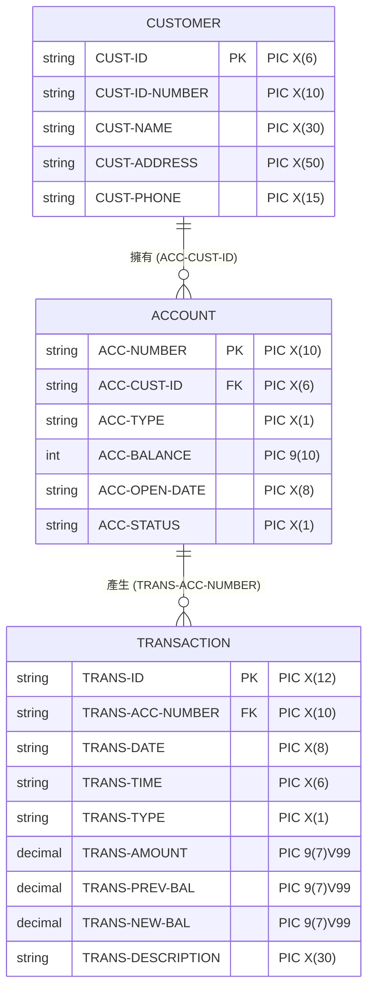

# 銀行管理系統 - 資料結構說明文件

本文件詳細說明系統中使用的資料檔案格式與 COBOL 記錄結構（Record Layouts）。系統採用 **Line Sequential** 組織格式，即每行代表一筆紀錄，欄位依固定長度排列，並以換行字元（LF 或 CRLF）作為紀錄分隔符。

> [!WARNING]
> 本專案僅作為程式碼寫法範例展示，並未實作任何資料加密或安全防護機制（如身分證字號、電話、餘額與交易明細等敏感資訊均為明文儲存）。請勿直接將本專案套用於實際的生產系統或商業環境中。

---

## 1. 實體關係圖 (Entity Relationship Diagram)

系統中的資料由三張循序表組成，其關聯性如下所示：



---

## 2. 客戶資料檔 (CUSTOMER.SAM)

儲存客戶的基本身分資訊。每筆紀錄固定長度為 **111 位元組（Bytes）**。

### COBOL 結構定義

```cobol
FD  CUSTOMER-FILE.
01  CUSTOMER-RECORD.
    05  CUST-ID             PIC X(6).       *> 客戶唯一ID
    05  CUST-ID-NUMBER      PIC X(10).      *> 身分證字號
    05  CUST-NAME           PIC X(30).      *> 客戶姓名 (填補空格)
    05  CUST-ADDRESS        PIC X(50).      *> 客戶地址 (填補空格)
    05  CUST-PHONE          PIC X(15).      *> 客戶電話 (15位字元)
```

### 欄位詳細說明

| 欄位名稱 | COBOL 型態 | 長度 (Bytes) | 說明 |
| :--- | :--- | :---: | :--- |
| `CUST-ID` | `PIC X(6)` | 6 | 客戶唯一識別碼。系統會自動從 `000001` 開始遞增生成，不足 6 位在右側填補空格。 |
| `CUST-ID-NUMBER` | `PIC X(10)` | 10 | 台灣身分證字號（如 `A123456789`）。系統會透過加權校驗演算法進行驗證。 |
| `CUST-NAME` | `PIC X(30)` | 30 | 客戶姓名，支援中英文。中文字元在 UTF-8 環境下每個佔 3 位元組，不足長度在右側填補空格。 |
| `CUST-ADDRESS` | `PIC X(50)` | 50 | 客戶聯絡地址，不足長度在右側填補空格。 |
| `CUST-PHONE` | `PIC X(15)` | 15 | 客戶電話號碼（如 `0912345678` 或 `02-23456789`）。 |

### 檔案資料範例

```text
000001A123456789王小明                          台北市信義區信義路五段7號                         0912345678     
```
* `000001`：客戶 ID（佔 6 欄位）。
* `A123456789`：身分證字號（佔 10 欄位）。
* `王小明                          `：姓名（佔 30 欄位，後方以空格填滿）。
* `台北市信義區信義路五段7號                         `：地址（佔 50 欄位，後方以空格填滿）。
* `0912345678     `：電話號碼（佔 15 欄位，後方以空格填滿）。

---

## 3. 帳戶資料檔 (ACCOUNT.SAM)

儲存所有銀行帳戶的餘額與狀態。每筆紀錄固定長度為 **36 位元組（Bytes）**。

### COBOL 結構定義

```cobol
FD  ACCOUNT-FILE.
01  ACCOUNT-RECORD.
    05  ACC-NUMBER          PIC X(10).      *> 銀行帳號 (10位)
    05  ACC-CUST-ID         PIC X(6).       *> 關聯之客戶ID
    05  ACC-TYPE            PIC X(1).       *> 帳戶類型 (S: 儲蓄帳戶, C: 支票帳戶)
        88  SAVINGS         VALUE "S".
        88  CHECKING        VALUE "C".
    05  ACC-BALANCE         PIC 9(10).      *> 帳戶餘額 (無小數整數)
    05  ACC-OPEN-DATE       PIC X(8).       *> 開戶日期 (YYYYMMDD)
    05  ACC-STATUS          PIC X(1).       *> 帳戶狀態 (A: 啟用, C: 關閉, S: 凍結)
        88  ACTIVE          VALUE "A".
        88  CLOSED          VALUE "C".
        88  SUSPENDED       VALUE "S".
```

### 欄位詳細說明

| 欄位名稱 | COBOL 型態 | 長度 (Bytes) | 說明 |
| :--- | :--- | :---: | :--- |
| `ACC-NUMBER` | `PIC X(10)` | 10 | 銀行帳號，由系統從 `0000000001` 開始自動遞增生成。 |
| `ACC-CUST-ID` | `PIC X(6)` | 6 | 該帳戶所屬客戶的 ID，對應 `CUSTOMER.SAM` 中的 `CUST-ID`。 |
| `ACC-TYPE` | `PIC X(1)` | 1 | 帳戶類型：<br>`S`：儲蓄帳戶 (Savings)<br>`C`：支票帳戶 (Checking) |
| `ACC-BALANCE` | `PIC 9(10)` | 10 | 帳戶餘額，前導補 0（例如整數 `0000500000` 元，最大可達 9,999,999,999 元）。 |
| `ACC-OPEN-DATE` | `PIC X(8)` | 8 | 開戶日期，格式為 `YYYYMMDD`（例如 `20260712`）。 |
| `ACC-STATUS` | `PIC X(1)` | 1 | 帳戶狀態：<br>`A`：啟用 (Active)<br>`C`：關閉 (Closed)<br>`S`：凍結 (Suspended) |

### 檔案資料範例

```text
0000000001000001S000050000020260712A
```
* `0000000001`：帳號為 1。
* `000001`：客戶 ID 為 1。
* `S`：帳戶類型為儲蓄帳戶。
* `0000500000`：帳戶餘額為 500,000 元（以 0 補足前導位數）。
* `20260712`：開戶日期為 2026 年 7 月 12 日。
* `A`：帳戶狀態為啟用。

---

## 4. 交易紀錄檔 (TRANS.SAM)

儲存所有的存款、提款及轉帳交易歷史紀錄。每筆紀錄固定長度為 **94 位元組（Bytes）**。

### COBOL 結構定義

```cobol
FD  TRANS-FILE.
01  TRANS-RECORD.
    05  TRANS-ID            PIC X(12).      *> 交易唯一ID
    05  TRANS-ACC-NUMBER    PIC X(10).      *> 交易帳號
    05  TRANS-DATE          PIC X(8).       *> 交易日期 (YYYYMMDD)
    05  TRANS-TIME          PIC X(6).       *> 交易時間 (HHMMSS)
    05  TRANS-TYPE          PIC X(1).       *> 交易型態 (D: 存款, W: 提款, T: 轉帳)
        88  DEPOSIT         VALUE "D".
        88  WITHDRAWAL      VALUE "W".
        88  TRANSFER        VALUE "T".
    05  TRANS-AMOUNT        PIC 9(7)V99.    *> 交易金額 (含2位虛擬小數)
    05  TRANS-PREV-BAL      PIC 9(7)V99.    *> 交易前餘額 (含2位虛擬小數)
    05  TRANS-NEW-BAL       PIC 9(7)V99.    *> 交易後餘額 (含2位虛擬小數)
    05  TRANS-DESCRIPTION   PIC X(30).      *> 交易說明描述 (填補空格)
```

### 欄位詳細說明

| 欄位名稱 | COBOL 型態 | 長度 (Bytes) | 說明 |
| :--- | :--- | :---: | :--- |
| `TRANS-ID` | `PIC X(12)` | 12 | 交易唯一識別碼，系統自動遞增生成（前導補 0）。 |
| `TRANS-ACC-NUMBER` | `PIC X(10)` | 10 | 該筆交易對應的銀行帳號。 |
| `TRANS-DATE` | `PIC X(8)` | 8 | 交易日期，格式為 `YYYYMMDD`。 |
| `TRANS-TIME` | `PIC X(6)` | 6 | 交易時間，格式為 `HHMMSS`。 |
| `TRANS-TYPE` | `PIC X(1)` | 1 | 交易型態：<br>`D`：存款 (Deposit)<br>`W`：提款 (Withdrawal)<br>`T`：轉帳 (Transfer) |
| `TRANS-AMOUNT` | `PIC 9(7)V99` | 9 | 交易金額。`V` 代表隱式小數點，實體檔案中**不佔用位元組**。例如：檔案中儲存為 `001000000`，表示 `10,000.00`。 |
| `TRANS-PREV-BAL` | `PIC 9(7)V99` | 9 | 交易前的帳戶餘額（含 2 位隱式小數）。 |
| `TRANS-NEW-BAL` | `PIC 9(7)V99` | 9 | 交易後的帳戶餘額（含 2 位隱式小數）。 |
| `TRANS-DESCRIPTION` | `PIC X(30)` | 30 | 交易說明描述（如「初始存款」、「櫃台存款」、「轉出至帳號: 0000000002」等），不足 30 位以空格補齊。 |

### 隱式小數點範例與解析

當金額定義為 `PIC 9(7)V99` 時：
* 實際長度：7 位整數 + 2 位小數 = 9 位元組。
* 範例值 `000200050`：
  - 前 7 位 `0002000` 代表整數 `2000`。
  - 後 2 位 `50` 代表小數 `.50`。
  - 實際值為 `2,000.50` 元。

### 檔案資料範例

```text
000000000009000000000120260712121544T000200000001500000001300000轉出至帳號: 0000000002     
```
* `000000000009`：交易 ID（12 位）。
* `0000000001`：交易帳號（10 位）。
* `20260712`：交易日期（8 位）。
* `121544`：交易時間 12 點 15 分 44 秒（6 位）。
* `T`：轉帳交易（1 位）。
* `000200000`：交易金額 `2,000.00` 元（9 位）。
* `001500000`：交易前餘額 `15,000.00` 元（9 位）。
* `001300000`：交易後餘額 `13,000.00` 元（9 位）。
* `轉出至帳號: 0000000002     `：轉帳描述（30 位）。

---

## 5. 暫存帳戶檔 (TEMP-ACCOUNT.SAM)

結構與 `ACCOUNT.SAM` 完全相同（固定長度 36 位元組），主要用於暫存更新後的帳戶資料。詳細使用機制請參見 [系統操作與編譯指南](./operation_manual.md) 中的「安全檔案更新機制」說明。